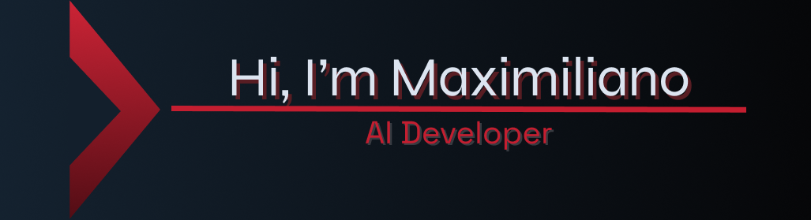

<h2 align="left">Languages, Tools and skills:</h2>
<h3 align="left">AI:</h3>

  
  

<h3 align="left">DataBase:</h3>

  
  

<h3 align="left">Design:</h3>

  
  

<h3 align="left">IDE:</h3>

  

<h3 align="left">Languages:</h3>

  
  
  
  
  

<h3 align="left">OS:</h3>

  

<h3 align="left">🌱 Currently learning:</h3>

  
  

<h2 align="left">📊 GitHub Stats:</h2>

  
  

<!--
**Maxigiraldo/Maxigiraldo** is a ✨ _special_ ✨ repository because its `README.md` (this file) appears on your GitHub profile.

Here are some ideas to get you started:

- 🔭 I’m currently working on ...
- 🌱 I’m currently learning ...
- 👯 I’m looking to collaborate on ...
- 🤔 I’m looking for help with ...
- 💬 Ask me about ...
- 📫 How to reach me: ...
- 😄 Pronouns: ...
- ⚡ Fun fact: ...
-->
